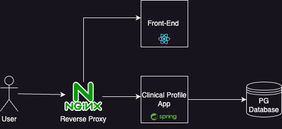
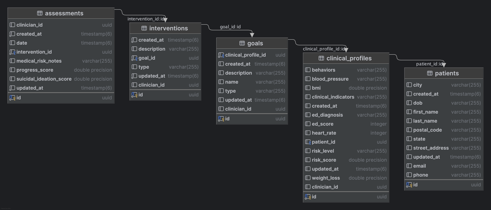

# EquipHealth Clinical Profile

This is a simple web application to create and view clinical profiles for patients. It is limited in scope as was built to demo creating an API. 

## Running the application
in the root directory run:
```
docker-compose build
```
then
```
docker-compose up
```

The application will be available at http://localhost


## Running the tests

under /api run:
```
./gradlew test
```

## Project Structure



The application consists of the following main components:

### Frontend (`/web`)
- **Components**
  - `ClinicalProfileDetails.js` - Displays detailed view of a clinical profile
  - `ClinicalProfileList.js` - Shows list of clinical profiles
  - `ClinicalProfileForm.js` - Form for creating/editing clinical profiles
  - `PatientForm.js` - Form for patient information
  - `PatientList.js` - Displays list of patients

- **Services**
  - `patientService.js` - Handles API calls for patient and clinical profile data

### Backend (`/api`)



- **Controllers**
  - `PatientController` - Handles HTTP requests for patient operations
  - `ClinicalProfileController` - Manages clinical profile endpoints

- **Services**
  - `PatientService` - Business logic for patient operations
  - `ClinicalProfileService` - Business logic for clinical profiles

- **Models**
  - `Patient` - Patient entity
  - `ClinicalProfile` - Clinical profiles for patients
  - `Goals` - Goals for a clinical profile
  - `Interventions` - Interventions for a Goal

### Configuration
- `nginx.conf` - Nginx web server configuration
- `docker-compose.yaml` - Docker compose configuration for running the application


## Notes

### Transactional Profile Creation
The Clinical Profile is built transactinaly. Grouping the Profile Goals and Interventions into a single transaction. This allows rollback of the entire profile if any of the steps fail and we aren't left with a partial profile.

Another way to do this would be to create the profile first, then create the goals and interventions as child resources of the profile. This would simplify the implementation but would leave us with partial profile if the goals or interventions were not created. 

## Auditing

I added Hibernate envers to support auditing. This allows us to track changes to the data. This stores the audit information in the same database as the main data.

Another option would be to send the changes to a logging system or event store. The issue with this is that it would make these systems also responsible for HIPPA compliance.

Added a listener to automatically add the userId of the updater to the table. This will provide a clear audit trail of who made the change and when.

## future improvements
* Caching
* RBAC
